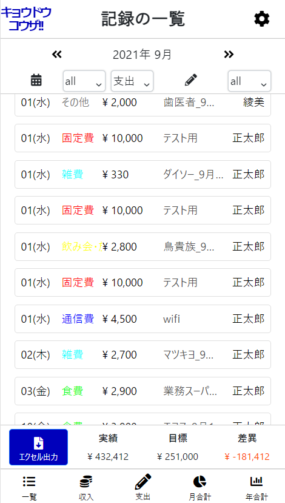
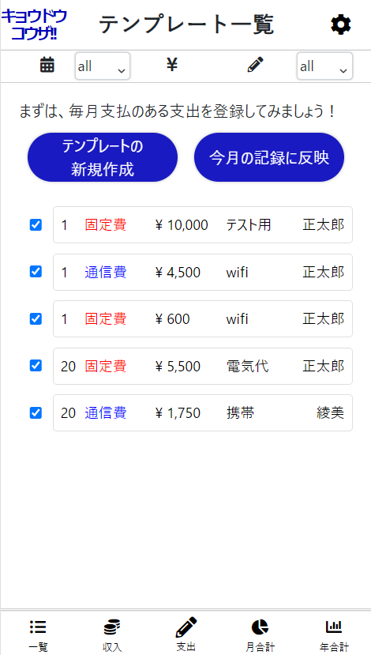
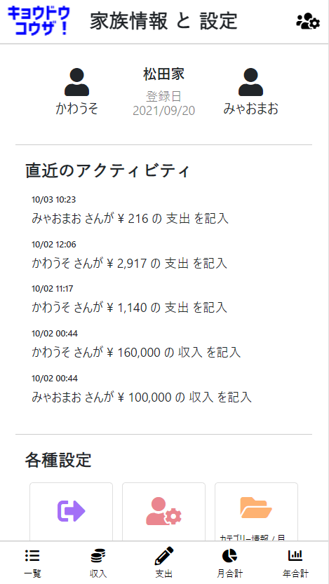
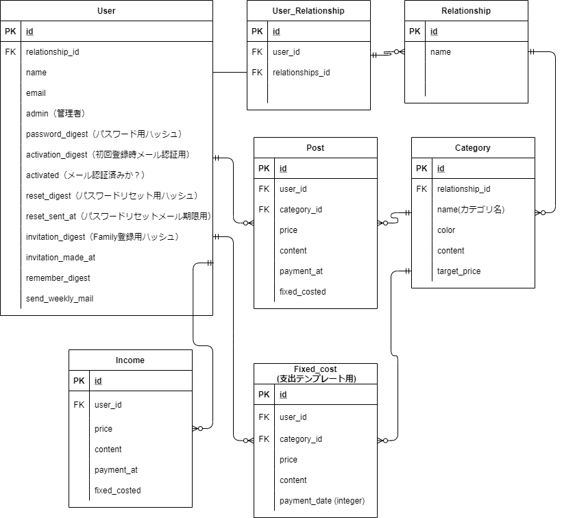

# 共同口座専用の家計簿アプリ「キョウドウコウザ」

http://www.kyodokoza.com/

 
 

## 概要
シンプルかつ見やすさにこだわった「共同口座（共用口座・共同財布）向けの家計簿アプリ」です。

 
家計簿アプリは世の中に多々ありますが、私個人に合うものがなかったため自作しました。また、同様の悩みを抱える方にお使いいただければと思っております。 
 

---

## 工夫した点
### ユーザー目線
- レスポンシブ化(スマホで利用することが多くなることを想定)
- 入力画面のUI最適化(レスポンシブ化に加え、PCではキーボード入力に、スマホではタッチ電卓に対応)
- 入力履歴の可視化(入力のモチベーションアップ)
- 「カワウソくんのひとこと」をランダム表示(入力のモチベーションアップ)
- 支出のテンプレート機能を導入(入力作業の効率化)
- ユーザーフレンドリーなエラー画面(404エラー,500エラー画面の設定)
- クエリ発行の高速化(N+1問題対応)
- 夫婦二人で使うことにこだわりたかったので、ユーザーの交流などはできない仕様に。また、登録作業をできうる限りセキュリティに配慮しつつ、シンプルにした （2人が会員登録→片方が他方の認証コードとアドレスを入力）
### 開発者目線
- CircleCIでCI/CDパイプラインの構築
- dockerのコンテナをDB/Rails/webpack-dev-serverの３コンテナ構造とし、ホットリロードで開発効率化
 
 

---

## アプリ作成の経緯
### 現状
私は現在、夫婦で共同口座形式で家計を運用してます。   
月初に夫婦それぞれの口座から、共同口座に定額入金   
→普段は個人口座/個人財布から出金 
→月末にレシートや領収書を元に共同口座から清算 

### 課題
- 清算作業が月末に偏るため、ヌケモレ発生する。
- 月末以外は、夫婦合わせて現状どれくらい支出があるかわからない 

#### その後いくつかの家計簿アプリやエクセルを使いましたが、そこでも課題を感じました。
 

- 写真の画像解析で自動入力→ 解析制度が悪い。
- 料金がかかる
- レシート入力作業が属人化する(夫婦2人のコスト意識向上につながらない)

### 目標
- 随時支出の記録を行い、月末以外でも支出の合計を把握しやすいようにする
- 夫婦2人で手軽に入力作業ができるようにする
- 今後複雑な解析をしたいと考えた時のために、データをエクセルと統合できるようにする
 
 

---
## 実装機能

### 基本機能
- ゲストログイン機能
- 会員登録、家族登録、ログイン
- メールを用いたパスワードリセット機能
### 記録機能
- ユーザ・家族情報の編集、削除
- カテゴリ登録、編集、削除
- 目標額の設定、編集
- 支出の登録、編集、削除
- 収入の登録、編集、削除
- 毎月支出されることが多い項目(テンプレート)の登録、編集、削除
### 集計・見える化機能 等
- 支出・収入の一覧、ソート機能（カテゴリ毎、ユーザー毎）
- 月毎の支出の集計（カテゴリ毎、ユーザー毎、対目標額）
- 月毎の比較（支出、収入）
- 残高表示
- エクセル出力機能(単月出力・範囲指定による複数月出力)
- 入力履歴の可視化
- SNSシェアボタン
 
 

---
## 使用技術
### フロントエンド
- HTML/CSS
- Javascript
- Bootstrap 5.1.0
- chart.js

### バックエンド
- Ruby 2.7.4
- Ruby on Rails 6.1.4
- RSpec

### インフラ・開発環境
- Docker/Docker-compode
- CircleCI(CI/CD)
- Heroku
- MySQL(DB)
- Redids(sidekiq)
- SendGrid(mailer)

### 主要gem
- chartkick(グラフの描画)
- caxlsx(excel出力)
- rspec(テスト)
- rubocop(静的解析)
- sidekiq, sidekiq-scheduler(バッチ処理 / 定期メール配信等) ※実装途中
 
 

---
## インフラ構成図
作成中
 
 

## ER図

