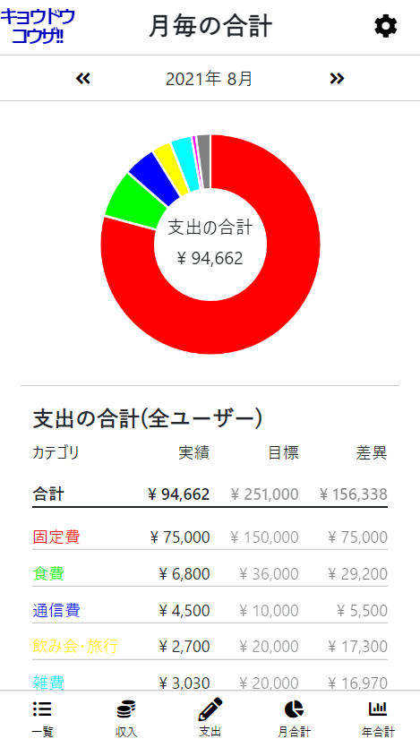

# 共同口座専用の家計簿アプリ「キョウドウコウザ」

http://kyodokoza.herokuapp.com/

## 概要
シンプルかつ見やすさにこだわった「共同口座（共用口座・共同財布）向けの家計簿アプリ」です。

 
家計簿アプリは世の中に多々ありますが、私個人に合うものがなかったため自作しました。また、同様のニーズも世の中にはあると考え、OPENに使える形で公開しております。

#### 現状
夫婦で、共同口座形式で家計を運用してます。   
月初に夫婦それぞれの口座から、共同口座に定額入金   
→普段は個人口座/個人財布から出金 
→月末にレシートや領収書を元に共同口座から清算 

#### 課題
- 清算作業が月末に偏るため、ヌケモレ発生する。
- 月末以外は、夫婦合わせて現状どれくらい支出があるかわからない 
その後いくつかの家計簿アプリやエクセルを使いましたが、そこでも課題を感じました。   
- 写真の画像解析で自動入力→ 解析制度が悪い。
- 料金がかかる
- 作業が属人化する(夫婦2人のコスト意識向上につながらない)

#### 目標
- 適宜支出の記録を行い、月末以外でも支出の合計を把握しやすいようにする
- 夫婦2人で手軽に入力作業ができるようにする
- 今後複雑な解析をしたいと考えた時のために、データをエクセルと統合できるようにする

## 実装機能

#### 基本機能
- ゲストログイン機能
- 会員登録、家族登録、ログイン
- メールを用いたパスワードリセット機能
#### 記録機能
- ユーザ・家族情報の編集、削除
- カテゴリ登録、編集、削除
- 目標額の設定、編集
- 支出の登録、編集、削除
- 収入の登録、編集、削除
- 毎月支出されることが多い項目（固定費）の登録、編集、削除
#### 集計・見える化機能
- 支出・収入の一覧、ソート機能（カテゴリ毎、ユーザー毎）
- 月毎の支出の集計（カテゴリ毎、ユーザー毎、対目標額）
- 月毎の比較（支出、収入）
- 残高表示
- エクセル出力機能(単月出力・範囲指定による複数月出力)
- メールでの毎週のレポート機能

## 使用技術
#### フロントエンド
- HTML/CSS
- Javascript
- Bootstrap 5.1.0
- chart.js

#### バックエンド
- Ruby 2.7.4
- Ruby on Rails 6.1.4
- RSpec

#### インフラ・開発環境
- Docker/Docker-compode
- CircleCI(CI/CD)
- Heroku
- SendGrid(mailer)

## ER図
[ER図はこちら](/ER.drawio)

## 工夫した点
- スマホで利用することが多くなることを想定し、レスポンシブ化
- 入力作業の効率化のため、固定費機能を導入。また、毎月変動する固定費（電気代や携帯料金等）を想定し、固定費として登録された支出を任意のタイミングで修正し、選択した上で支出に反映。
- herokuのsleepを防ぐため、heroku schedulerで10分毎に起動
- CircleCIでCI/CDパイプラインの構築
- dockerのコンテナをDB/Rails/webpack-dev-serverの３コンテナ構造とし、ホットリロードで開発効率化

